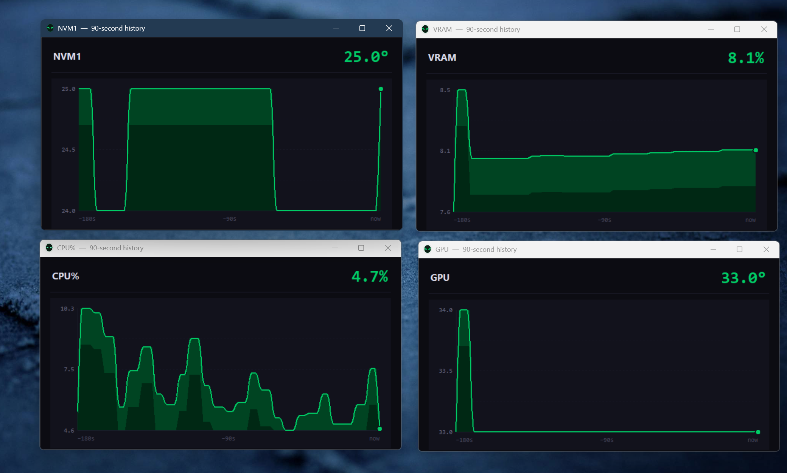
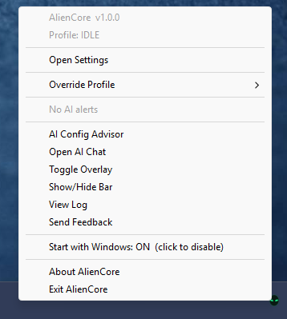
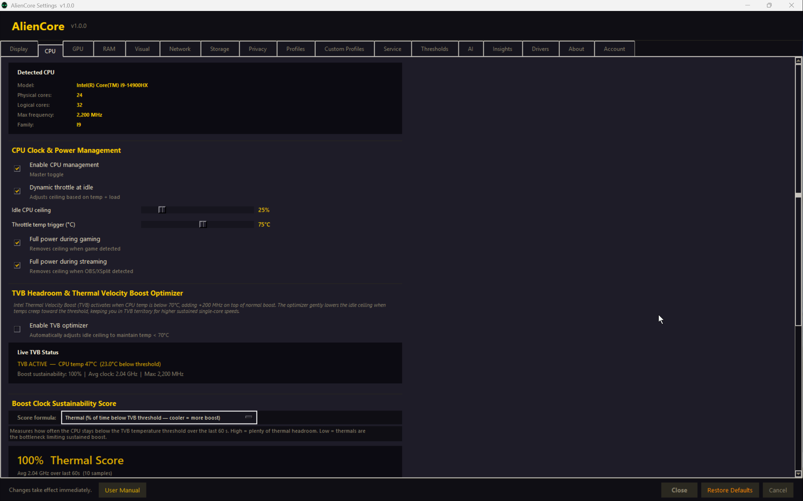
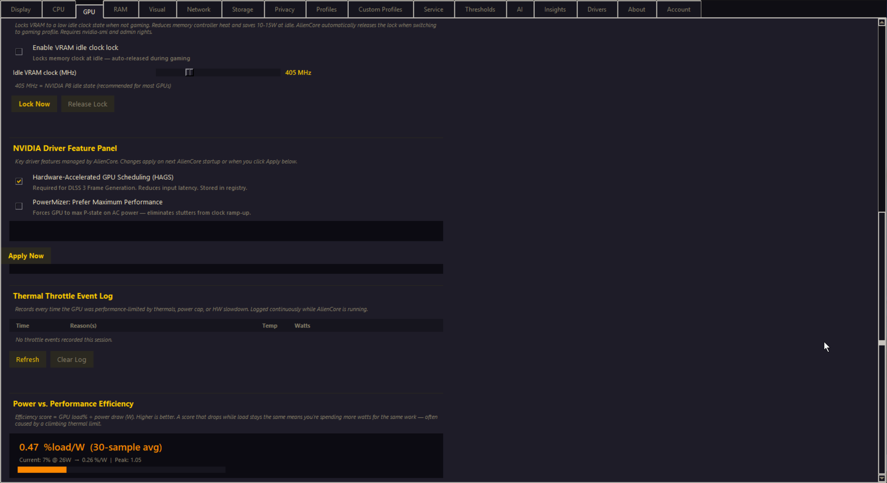
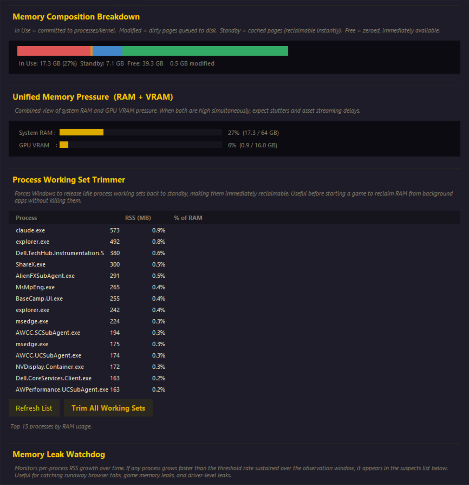
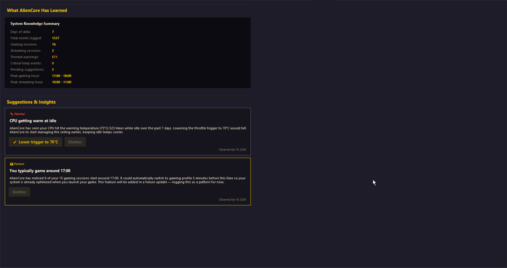
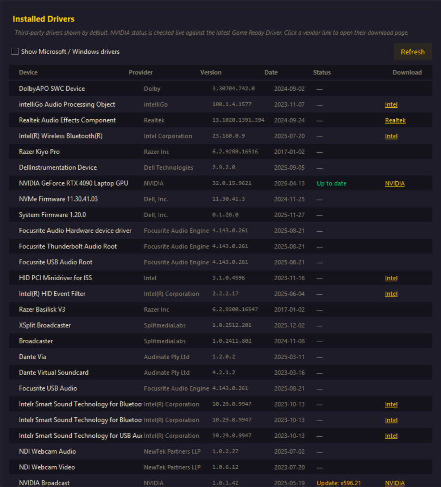
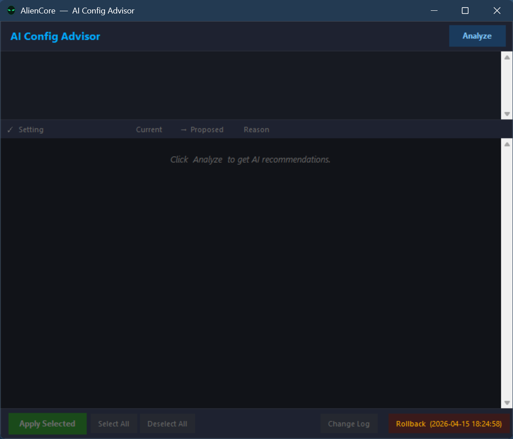
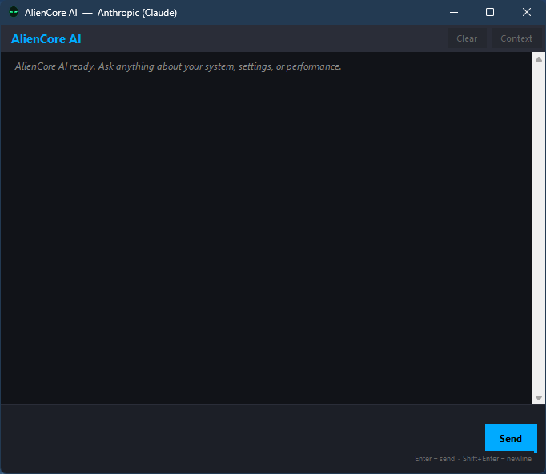

<div align="center">

# ⟁ AlienCore

### One app. Every tweak. Always adapting.

[](#coming-soon)
[](https://github.com/mourninggrace/AlienCore)
[](https://github.com/mourninggrace/AlienCore)
[](https://github.com/mourninggrace/AlienCore)
[](./LICENSE)
[](https://github.com/mourninggrace/AlienCore)

*Your PC has dozens of power, thermal, and priority settings. AlienCore adjusts them automatically based on what you're actually doing — gaming, streaming, working, or idle.*

</div>

---

<a id="coming-soon"></a>

> ### 🚀 Coming Soon — Launch Imminent
>
> AlienCore is in final pre-release polish and ships **very soon**. The public v1.0.0 build will be available to download and buy here the moment it lands.
>
> **Join the launch waitlist** — get an email the day AlienCore goes live (plus a one-time launch-week discount code):
>
> 👉 **[mourning.grace.2014@gmail.com](mailto:mourning.grace.2014@gmail.com?subject=AlienCore%20waitlist)** — send any message with the subject **"AlienCore waitlist"** and you're in. No spam, no list-sharing, one email at launch.
>
> Want to follow progress instead? Watch this repo (top-right ⭐ / 👁️) — release notes post here the moment builds ship.

---

## What Is AlienCore?

AlienCore is an **adaptive Windows system optimizer** that watches your workload in real time and applies the right CPU, GPU, RAM, network, and privacy settings automatically — without you touching anything.

Instead of juggling HWiNFO, MSI Afterburner, Process Lasso, ThrottleStop, RAMMap, and a folder full of PowerShell scripts, AlienCore replaces all of them with a single lightweight background service, a floating sensor bar, and an optional AI assistant.

Launch a game → clocks ramp, network latency drops, background processes get demoted, GPU power opens up. In under a second.  
Close the game → everything winds back down. Quieter fans. Cooler silicon. Better battery.

That's the way Windows should have worked out of the box.

---

## Screenshots

### Floating sensor bar — idle


The always-on-top heads-up display that lives at the top of your screen. At idle: profile badge reads **IDLE**, CPU is loafing at 46°C and 5%, GPU is barely awake, and AlienCore has dropped the CPU ceiling into its low-power band. Every cell is live — the sparkline under each number shows the last 90 seconds of history, color-shifting green/amber/red as values cross your configured thresholds. Fully resizable by dragging its bottom edge. Can be toggled vertical.

### Floating sensor bar — under gaming load


Same bar, seconds after launching a game. Profile badge has automatically flipped to **GAMING**, the fan cell is showing **7.4K RPM in red**, and NVM1/NVM2/DIMM cells are tracking drives spinning up. The transition is automatic — AlienCore detected the workload from the process list, GPU activity, and load signature, then swapped profiles and applied matching tweaks in under a second.

### Sparkline pop-outs



Double-click any cell to pop out a larger 90-second history graph. Open as many as you want and drag them anywhere — shown here with NVMe temp, VRAM usage, CPU load, and GPU temp tracked side-by-side.

### Tray icon right-click menu



The alien-head tray icon color-shifts between green, amber, and red based on CPU package temperature. Right-click exposes the full menu: open Settings, override the active profile, open AI tools, toggle overlay visibility, view the log, toggle Windows startup, or quit cleanly. AI menu items are Pro features and only appear when a valid AI provider is configured.

### Settings — CPU tab



Detects your processor and exposes every clock and power knob AlienCore manages. Dynamic throttle at idle with adjustable temp-and-load triggers, idle and throttle-trigger ceilings with live sliders, full-power toggles for gaming and streaming, the **TVB Headroom & Thermal Velocity Boost Optimizer**, and the **Boost Clock Sustainability Score** — a rolling rating of how much of your CPU's theoretical boost budget you're actually getting.

### Settings — GPU tab



NVIDIA-first via NVML — the same API MSI Afterburner uses. VRAM idle-clock locking, NVIDIA driver feature toggles, a live **Thermal Throttle Event Log** with timestamped captures, and a **Power vs. Performance Efficiency** panel giving you a %load/Watt score across a rolling sample window.

### Settings — RAM tab



Breaks Windows memory into real categories (In Use / Modified / Standby / Free), shows **Unified Memory Pressure** across system RAM and VRAM together, exposes the **Working Set Trimmer** for per-process RAM reclaim without killing, and includes the **Memory Leak Watchdog** to catch per-process RSS growth before you run out of RAM.

### Settings — Insights tab



The **Learning Engine** surfaces what AlienCore has noticed about your system over time — events logged, gaming sessions, thermal warnings, peak usage hours, and actionable one-click suggestions. All learning happens locally. Nothing is sent to any server.

### Settings — Drivers tab



Scans your installed driver stack, shows version + date + vendor for every driver touching a real device, and highlights any driver with a newer version available upstream. Click **Download** to jump straight to the vendor page.

### AI Config Advisor



A Pro feature that sends a snapshot of your current config plus recent sensor history to your AI provider of choice and asks it to propose tuned values. Returns a **Setting → Current → Proposed → Reason** table — each row individually checkboxable. Nothing applied without your explicit confirmation. **Rollback** button restores the previous config snapshot.

### AI Chat



A direct pipe to any OpenAI-compatible provider, with AlienCore's live system context silently attached to every conversation. Ask *"why is my CPU at 85°C just browsing?"* and it can actually see your sensor readings and config when it answers.

---

## Features

### 🎯 Adaptive Profile Engine
Detects your workload every 15 seconds (Idle / Gaming / Streaming / Custom) and applies a matched profile covering CPU clocks, GPU power, scheduler priorities, network latency, and storage behavior. Transitions happen in real time — no manual switching.

### 🌡️ Floating Sensor Bar
Always-on-top readout showing live CPU, GPU, hotspot, NVMe, DIMM temps, clocks, watts, fan RPMs, network and disk I/O, VRAM usage, battery, and system clock. Drag to resize. Click any cell for a 90-sample sparkline. Pulsing perimeter doubles as an ambient CPU-load indicator.

### 🧊 Dynamic CPU Ceiling
Drops max processor state to 25% when idle and cool. Ramps to 45 / 80 / 100% based on live temperature and load. Quieter, cooler, better battery — without the sluggishness of a fixed Battery Saver plan.

### 🎮 NVIDIA GPU Tuning
Core and memory clock offsets, firmware-clamped power limit, manual or automatic fan duty — all via NVIDIA's official NVML API. Same tuning surface as MSI Afterburner, wired into your profile automations.

### 💎 Alienware Integration *(auto-detected)*
Direct AWCC WMI hook for thermal profile sync (Quiet / Balanced / Performance / G-Mode), real fan RPMs, and Turbo Cool max-fan mode — without ever opening Alienware Command Center. Validated on the m18 R2 and all post-2019 Alienware chassis.

### 🧠 AI Assistant *(optional, Pro)*
Chat with Claude, GPT, Gemini, Mistral, Groq, or your own local Ollama / LM Studio instance. Live sensor context is attached to every conversation automatically. The AI Config Advisor proposes tuned values for your specific hardware. High-risk actions are gated behind an explicit confirmation dialog — the AI cannot silently damage your system.

### 🔒 Privacy + System Baseline
One-click, reversible disable of Windows telemetry (DiagTrack), advertising ID, activity history, Cortana, and feedback prompts. NIC-level tuning (RSS, EEE, flow control, interrupt moderation). Storage baseline (TRIM, disable 8.3 names, disable last-access timestamps). Every change undone with `--restore-defaults`.

### 🛡️ RAM Watchdog + Standby Cache
Detects memory leaks by monitoring per-process RSS growth rate. Automatically clears Windows standby cache when memory pressure crosses a threshold. DIMM throttle protection stays active when modules run hot.

### 🤖 Learning Engine
Logs every profile transition and tweak effect to a local database, runs hourly analysis to identify patterns, and surfaces actionable suggestions. No cloud. No data sent anywhere.

### 🔄 Auto-Update
Checks GitHub Releases automatically — 30 seconds after launch, then every 6 hours. A plain HTTPS GET to `api.github.com`. No data leaves your machine.

| Choice | What happens |
|--------|-------------|
| **Update Now** | Downloads the release zip, extracts it, and relaunches automatically |
| **Not Now** | Dismisses the dialog; an amber **Update Available** button appears in Settings |
| **Remind Me in 24h** | Suppresses the dialog for 24 hours |

---

## What AlienCore Replaces

| Tool | What It Does | AlienCore |
|------|-------------|-----------|
| HWiNFO | Sensor monitoring | ✅ Built in — and acts on the data |
| MSI Afterburner | GPU tuning | ✅ Same NVML tuning surface |
| ThrottleStop | Intel CPU tuning | ✅ Built in (MSR scaffolding ready) |
| Process Lasso | Per-process CPU priority | ✅ Profile-driven EcoQoS + priority |
| RAMMap / EmptyStandbyList | Standby cache clearing | ✅ Built in + automatic |
| Alienware Command Center | Thermal profiles | ✅ Direct WMI integration |
| O&O ShutUp10 / WPD | Privacy tweaks | ✅ Baseline tweaks cover it |
| Custom PowerShell scripts | One-off system changes | ✅ Built in |

---

## Who It's For

- **Laptop owners** fighting heat, fan noise, and thermal throttling — especially Alienware and gaming laptops
- **Gamers** who want one profile for Warzone and another for browsing without manually flipping anything
- **Streamers** who need network + encoder priority + background-process demotion locked in before going live
- **Power users** tired of stacking half a dozen utilities just to have a properly tuned machine
- **Privacy-conscious users** who want Windows telemetry silenced without a dedicated tool
- **Alienware owners** — gets more out of AWCC than Alienware Command Center does, with a fraction of the bloat

---

## Pricing

| Tier | Price | What's Included |
|------|-------|----------------|
| **Base** | $19.99 one-time | All features — adaptive profiles, sensor bar, tray icon, OS tweaks, NVIDIA GPU tuning, Alienware AWCC integration, advanced CPU/GPU/RAM tuning, Windows services manager, privacy baseline, learning engine |
| **Pro Add-on** | +$4.99 one-time | AI chat, AI watchdog, AI Config Advisor |
| **Free Trial** | 30 days | Full base feature set — no payment required, hardware-fingerprinted |

---

## Documentation

- **[User Manual](https://mourninggrace.github.io/AlienCore/manual.html)** — full feature walkthrough, every setting explained, troubleshooting, and power-user tips. *(View online; requires GitHub Pages to be enabled — see `docs/manual.html` for the source file.)*
- **[Download the manual](https://raw.githubusercontent.com/mourninggrace/AlienCore/master/docs/manual.html)** — save the single-file HTML for offline reading.
- **[Changelog](./CHANGELOG.md)** — every release, what changed, and when.

The manual is also available from inside the app: **Settings → footer → User Manual**.

---

## Setup

1. **Install Python 3.10+** from [python.org](https://python.org) — check *Add to PATH* during install

2. **Run the dependency installer as Administrator:**
   ```
   python install_deps.py
   ```

3. **First run (opens settings GUI):**
   ```
   python aliencore.py --firstrun
   ```
   Choose your tweaks, click Save. AlienCore initializes immediately.

4. **Install as a Windows service** (run as Administrator):
   ```
   python aliencore.py --install
   ```
   AlienCore will now start automatically at boot, before login.

---

## Daily Use

- **System tray icon** shows current profile (Idle / Streaming / Gaming / Manual)
- **Tray → Open Settings** to change any option at any time
- **Tray → Override Profile** to manually lock a profile
- **Tray → View Log** to open `aliencore.log`
- **Tray → Exit** gracefully stops the service

---

## Uninstall

```
python aliencore.py --uninstall
```

Reverse all registry tweaks:
```
python aliencore.py --restore-defaults
```

---

## Project Structure

```
aliencore/
├── aliencore.py            ← Main entry point (service + CLI)
├── install_deps.py         ← Run once as Admin to install dependencies
├── config.json             ← Auto-generated on first run (your settings)
├── hardware_profile.json   ← Auto-generated hardware fingerprint
│
├── core/
│   ├── constants.py        ← Paths, thresholds, default config schema
│   ├── config_manager.py   ← Load/save/reload config.json
│   ├── logger.py           ← Rotating log setup
│   ├── hardware.py         ← Hardware fingerprint (CPU/GPU/RAM/drives)
│   ├── sensors.py          ← Live sensor polling (temps, RPM, usage)
│   ├── amd_smu.py          ← AMD CPU temp via Ryzen Master Platform.dll
│   ├── tweaks.py           ← Applies all system tweaks
│   ├── profiles.py         ← Profile detection and switching logic
│   └── monitor.py          ← Resident monitor loop
│
├── gui/
│   └── settings_gui.py     ← Full settings UI
│
├── assets/
│   ├── icon.png            ← Tray icon base image
│   └── screenshots/        ← Gallery images used in this README
│
├── profiles/               ← Named profile snapshots (JSON)
└── logs/
    └── aliencore.log       ← Rolling log file
```

---

## System Requirements

**Minimum**
- Windows 10 21H2 / Windows 11 (64-bit)
- Python 3.10+
- Intel 12th Gen+ or AMD Ryzen (Zen 3 / Zen 4)
- NVIDIA GeForce GPU (for GPU tuning features)
- 4 GB RAM / 150 MB storage
- Administrator rights (required for CPU temp and MSR access)

**Recommended**
- Windows 11 (64-bit)
- Intel 13th/14th Gen or AMD Ryzen 7000 series
- NVIDIA RTX with current driver
- 16 GB RAM
- Alienware m18 R2 or any post-2019 Alienware chassis *(unlocks full AWCC integration)*

---

## CPU Feature Matrix

| Feature | Intel 12th+ | AMD Ryzen |
|---------|------------|-----------|
| Sensor bar (temp / load / watts) | ✅ | ✅ |
| Per-core temp / load | ✅ P/E split | ✅ per-CCD |
| Thread Director / hetero-scheduling | ✅ | N/A (Precision Boost) |
| TVB Optimizer | ✅ i9 Raptor | ❌ |
| AI voltage tool (MSR) | ✅ scaffolded | 🔜 v2 |

---

## Portability

AlienCore runs on **any Windows machine with an NVIDIA GPU**, not just Alienware. On first run it fingerprints your hardware and calculates appropriate tweak values for your specific CPU, GPU, and RAM. Hardware-specific features degrade gracefully when not supported. Alienware-specific features (AWCC integration, G-Mode) only activate when an Alienware chassis is detected.

---

## Technical Notes

- No kernel driver installed by AlienCore itself. CPU MSR reads use the signed `WinRing0.sys` from LibreHardwareMonitor — the same driver HWiNFO uses.
- Licensing is hardware-fingerprinted but not online-gated. AlienCore continues working if the license server is unreachable.
- Undervolting (MSR 0x150) is wired through the UI but the MSR backend is currently stubbed — functional release planned. All other tuning features are live.
- Pure Python source. No obfuscation. Config in plain JSON. Logs to a rotating text file. Audit-friendly by design.
- Reference hardware: Alienware m18 R2 (i9-14900HX, RTX 4090 Mobile, 32 GB DDR5, Windows 11 Pro). Actively validated under daily load.

---

## Dependencies

Installed automatically by `install_deps.py`:

- `psutil` — process and system metrics
- `pywin32` — Windows API access
- `wmi` — WMI interface
- `pystray` — system tray icon
- `Pillow` — image handling
- `nvidia-ml-py` (`pynvml`) — NVIDIA NVML direct calls

LibreHardwareMonitor is bundled via `lhm_bridge.exe` and provides NVMe temps, fan RPM, non-NVIDIA GPU readings, and CPU package temp/watts. DIMM temperature sensors are hardware-dependent — many DDR4/DDR5 DIMMs do not expose thermal data; requires LHM Ring0 access (Memory Integrity must be disabled).

---

## Credits

AlienCore bundles **LibreHardwareMonitor** (MPL-2.0) for hardware sensor readings. See [THIRD_PARTY_LICENSES.md](THIRD_PARTY_LICENSES.md) for details.

---

## License

AlienCore is **source-available commercial software** — not open source. The
source is published so you can read it, audit it, and verify for yourself that
it isn't malware, isn't spyware, and isn't collecting anything beyond what the
documentation discloses. You may **not** fork it, redistribute it, modify it,
or resell it. Use requires a purchased license (or the 30-day free trial).

Copyright © 2026 George Kyle Yeroshefsky. All Rights Reserved.  
See [LICENSE](./LICENSE) for full terms.

---

<div align="center">
<sub>Built for people who know their hardware deserves better than whatever Windows shipped with.</sub>
</div>
